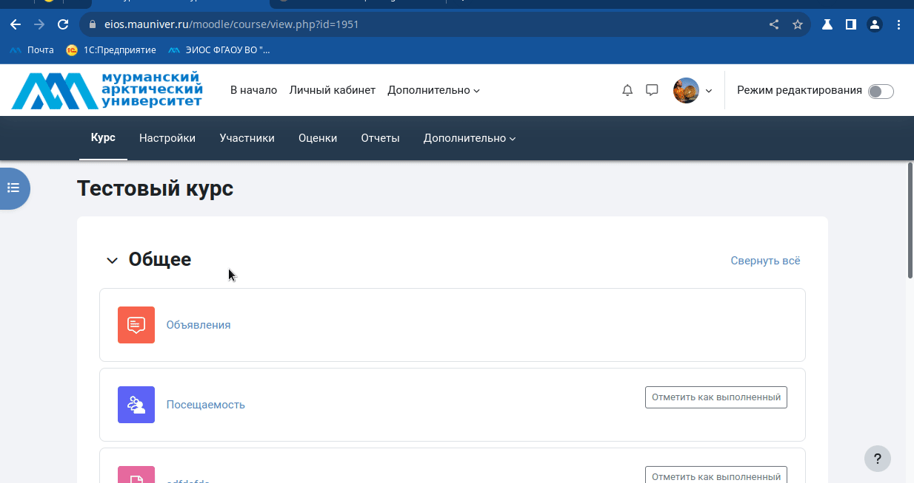

# Работа в ЭИОС 

## Предоставление доступа к курсу другому преподавателю

> [Вернуться к оглавлению](../index.md)

Для того, чтобы предоставить доступ другому преподавателю к вашему курсу необходимо его записать на курс и назначить роль преподавателя или роль преподавателя без права редактирования (преподаватель бпр).

### 1. **Синхронизация с глобальной группой** (как было раньше в МГТУ):
1. Перейдите в раздел **Участники** вашего курса.
2. Активируйте добавление преподавателя на курс кнопкой **Зачисление пользователей на курс**.
3. Выберите в раскрывающемся списке **Назначить роль** значение **Преподаватель** (или *Преподаватель бпр*) и начните писать в поле  **Выберите пользователей** фамилию преподавателя и система автоматически вам будет подставлять найденные значения
4. Добавьте преподавателя кнопкой **Зачислить выбранных пользователей и глобальные группы**.
