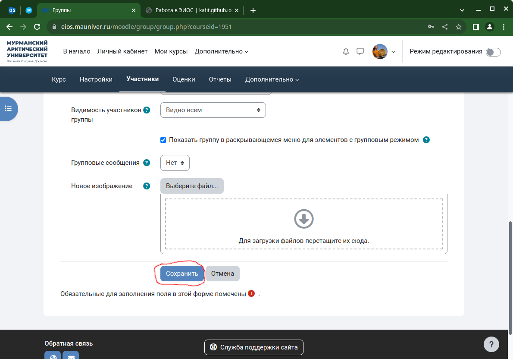

# Работа в ЭИОС 

## Запись студентов на курс

> [Вернуться к оглавлению](../index.md)

Для того, чтобы студенты могли получить доступ к заданиям курса конкретного преподавателя необходимо сначала студентов записать на курс. В ЭИОС университета используется 3 механизма записи студентов на курс преподавателя: синхронизация с глобальной группой; добавление студентов на курс с помощью кодового слова; индивидуальное добавление студентов на курс.

### 1. **Синхронизация с глобальной группой** (как было раньше в МГТУ):
1. Перейдите в раздел **Участники** вашего курса.

2. В раскрывающемся списке **Зачисленные на курс пользователи** выберите элемент списка **Способы зачисления на курс**.

3. В списке **Добавить способ** выберите **Синхронизация с глобальной группой**.

4. В списке **Глобальная группа** найдите шифр необходимой вам группы. 

5. Завершите добавление нажатием кнопки **Добавить способ**.

### 2. **Добавление студентов на курс с помощью кодового слова** (как было в МАГУ и очень давно в МГТУ)
1. Перейдите в раздел **Участники** вашего курса.

2. Убедитесь, что в списке способов зачисления на курс есть активный способ **Самостоятельная запись (Студент)** (пиктограмма глаза не должна быть перечеркнутой)
   > Если этого пункта нет, то его можно добавить по аналогии с синхронизацией с глобальной группой (см. выше) 

   

3. Откройте окно настроек способ зачисления на курс **Самостоятельная запись (Студент)** щелкнув по шелкнув по пиктограмме шестеренки

4. Активируйте режим использования кодовых слов для групп, выбрав в пункте **Использовать кодовые слова для групп** значение **Да** и сохраните изменения кнопкой **Сохранить** внизу страницы. 

3. В раскрывающемся списке **Зачисленные на курс пользователи** выберите элемент списка **Группы**.

4. Активируйте создание группы кнопкой **Создать группу**.

5. Укажите в поле **Название группы** удобное для вас название группы.

6. Введите в поле **Кодовое слово** любое слово, которое студенты смогут использовать для самозаписи на ваш курс.

7. Завершите создание группы кнопкой **Сохранить**.

8. **Сообщите** студентам установленное вами **кодовое слово** на своих с ними занятиях.

9. После этого студенты при доступе к курсу смогут в ответ на запрос системы вписать кодовое слово и записаться на ваш курс.

### 4. **Индивидуальное добавление студентов на курс** (как было в МАГУ и  МГТУ)
1. Перейдите в раздел **Участники** вашего курса.

3. Активируйте добавление студента на курс кнопкой **Зачисление пользователей на курс**.

3. Начните писать в поле  **Выберите пользователей** фамилию студента и система автоматически вам будет подставлять найденные значения

4. выберите студента/студентов, щелкнув основной кнопкой мыши по элементу списка

5. добавьте студента/студентов кнопкой **Зачислить выбранных пользователей и глобальные группы**.

---

> Набор инструкция по работе в ЭИОС ФГАОУ ВО "МАУ", разработанный преподавателями кафедры информационных технологий.
> 
> **авторы:** 
>   - Ляш Олег Иванович, 
>   - Ляш Ася Анатольеввна